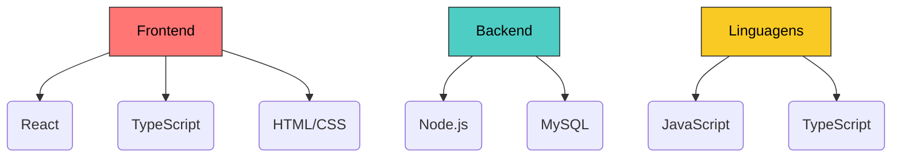

<!-- HEADER ANIMADO -->

 

# Daniel Macedo

**`Desenvolvedor FullStack | Estudante de Tecnologia.`**

---

## Sobre mim  

Olá! Eu sou o **Daniel Macedo**, desenvolvedor FullStack em formação.

Sou formado em **Técnico de Redes de Computadores pela Etec de Embu** e atualmente estou finalizando o **bootcamp da Generation Brasil**, onde venho aprimorando minhas habilidades em desenvolvimento web, APIs e aplicações modernas.

Gosto de transformar ideias em projetos funcionais, criar interfaces modernas e desenvolver soluções que realmente façam diferença no dia a dia. Estou sempre buscando evoluir como desenvolvedor e aprender novas tecnologias.

 

---

## Tecnologias que uso / estudo

  
  
   

  
  
  
   

  
  

---

### Stack Visual

---

## Estatísticas  

  

  

 

  

---

## Onde me encontrar

---

